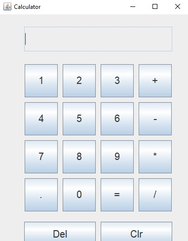

# Simple Calculator Application

This is a basic calculator application built using Java SE and Swing for GUI. It can perform four basic arithmetic operations: addition, subtraction, multiplication, and division.

## Tools/Technologies Used
- Java SE
- Swing (for GUI)
- Eclipse (IDE)

## Features
- Addition: Allows users to add two numbers.
- Subtraction: Allows users to subtract one number from another.
- Multiplication: Allows users to multiply two numbers.
- Division: Allows users to divide one number by another.

## How to Run
1. Clone the repository to your local machine.
2. Open the project in Eclipse.
3. Compile and run the Calculator.java file.
4. The calculator GUI will appear, allowing you to perform arithmetic operations.

## Screenshots
