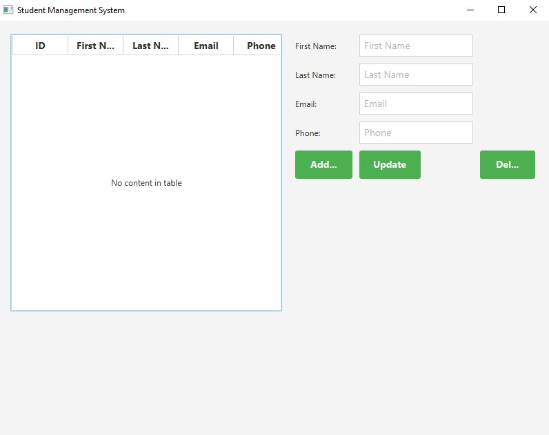

# Student Management System

A JavaFX application for managing student information, including adding, updating, and deleting student records, as well as viewing a list of students.



## Features

- **Add a New Student**: Enter student details and add them to the database.
- **Update an Existing Student**: Modify student details and update the database.
- **Delete a Student Record**: Remove a student from the database.
- **View a List of Students**: Display all students in a tabular format.

## Technologies Used

- **Java SE**
- **JavaFX** for the Graphical User Interface
- **MySQL** for the database
- **Eclipse** or **IntelliJ IDEA** for development

## Project Structure

```plaintext
student-management-system/
├── src/
│   ├── main/
│   │   ├── java/
│   │   │   ├── com/
│   │   │   │   ├── studentmanagement/
│   │   │   │   │   ├── Student.java
│   │   │   │   │   ├── StudentDAO.java
│   │   │   │   │   ├── StudentManagementApp.java
│   ├── resources/
│   │   ├── style.css
├── README.md
└── screenshot.png

```


## Setup Instructions

### Prerequisites

- **Java Development Kit (JDK)** 8 or higher
- **MySQL** database
- **Eclipse** or **IntelliJ IDEA**

### Database Setup

1. **Create the Database:**
    ```sql
    CREATE DATABASE studentdb;
    ```

2. **Create the `students` Table:**
    ```sql
    CREATE TABLE students (
        id INT AUTO_INCREMENT PRIMARY KEY,
        first_name VARCHAR(50),
        last_name VARCHAR(50),
        email VARCHAR(100),
        phone VARCHAR(15)
    );
    ```

3. **Update Database Credentials:**
    Modify the database connection details in `StudentDAO.java` to match your MySQL setup.

### Project Setup

1. **Clone the Repository:**
    ```sh
    git clone https://github.com/yourusername/student-management-system.git
    cd student-management-system
    ```

2. **Open the Project in Your IDE:**
    - Open Eclipse or IntelliJ IDEA.
    - Import the project as a Maven project (if applicable) or set up the project dependencies manually.

3. **Run the Application:**
    - Locate and run `StudentManagementApp.java`.
    - The application window should open, displaying the student management interface.

## Usage

### Adding a Student

1. Enter the student's first name, last name, email, and phone number in the respective fields.
2. Click the "Add Student" button.

### Updating a Student

1. Select a student from the table.
2. Modify the student's details in the form fields.
3. Click the "Update Student" button.

### Deleting a Student

1. Select a student from the table.
2. Click the "Delete Student" button.

## Contributing

Contributions are welcome! Please feel free to submit issues or pull requests.


